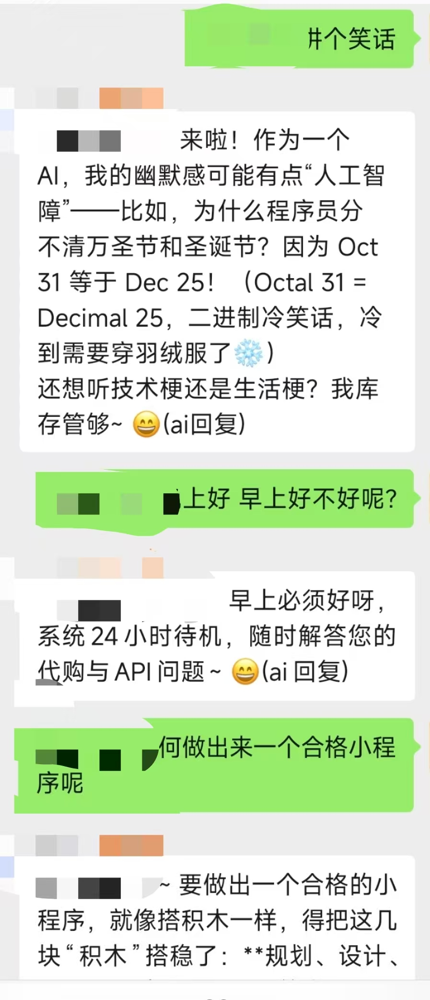
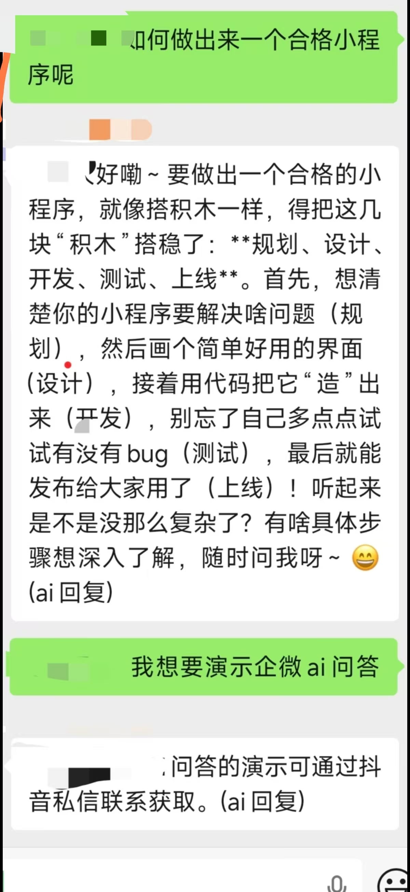
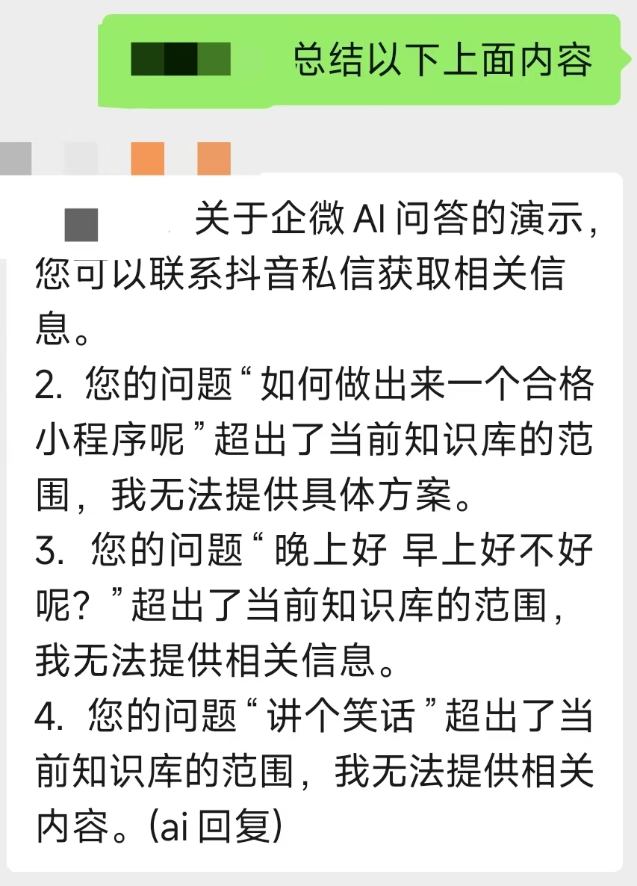
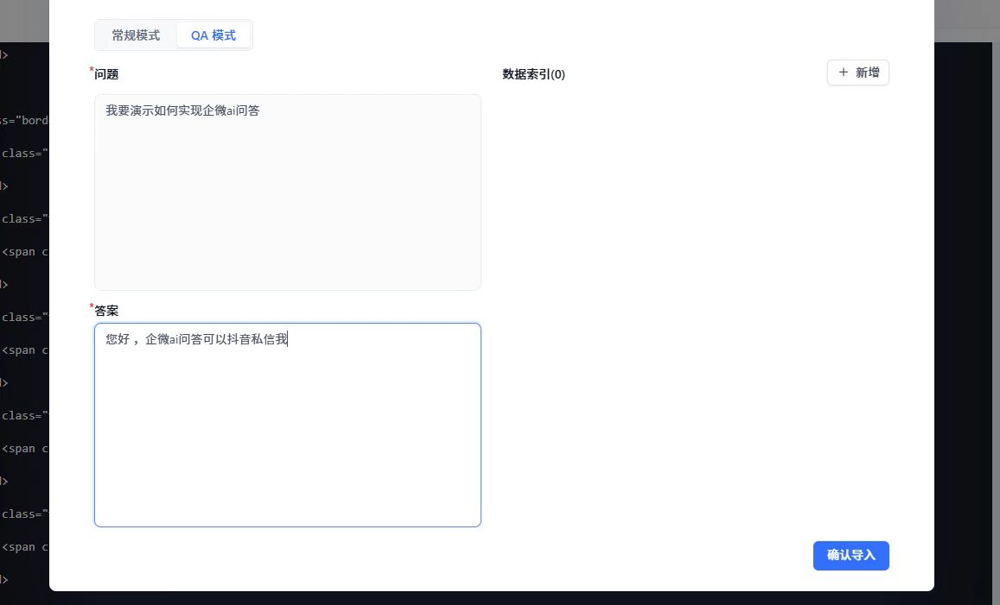
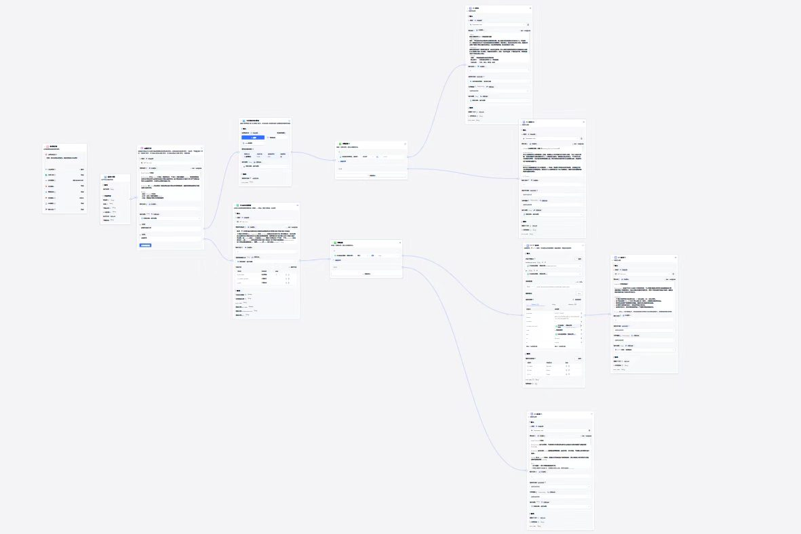
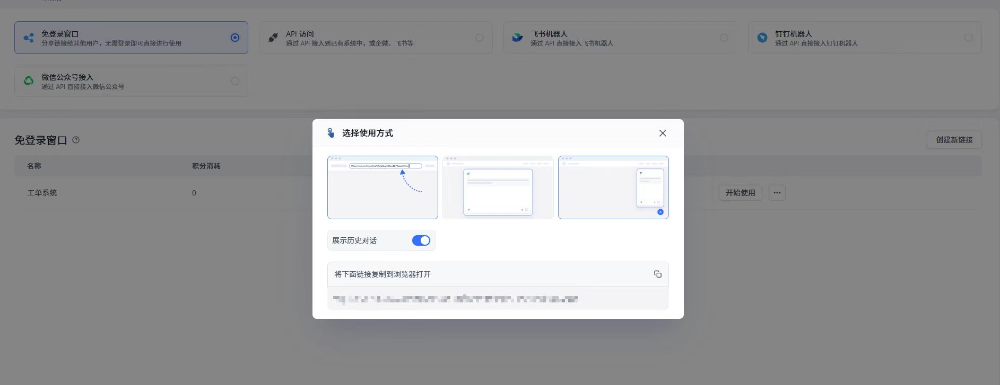
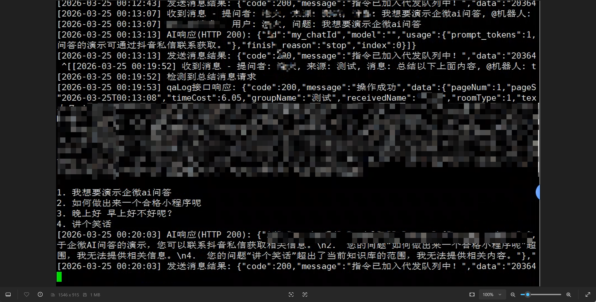

# 企业微信智能客服解决方案

> 基于 Agent 工作流 + 企业微信 API + 本地部署大模型 打造的高效智能客服系统

## 项目简介

本项目是一个利用 **Agent 工作流** 搭建平台 + **企业微信 API 接口** + **本地部署大模型** 的企业微信智能客服解决方案。

## 核心优势

相比其他解决方案（如 Open Cloud），本项目具有以下显著优势：

### 1. 配置灵活度高
- **自定义回复规则**：可以精确设置哪些消息需要回复，哪些消息不回复
- **固定回复内容**：针对特定消息可以设置固定的回复内容
- **灵活的消息过滤**：支持多维度消息筛选和匹配规则

### 2. 自定义推送能力
- **定时推送**：通过自定义脚本，可以在任何时间推送指定的活动内容或促销活动
- **精准触达**：支持针对特定用户群体进行消息推送
- **活动管理**：轻松管理各类营销活动和促销信息

### 3. 完全可控的 AI 能力
- **推送内容可控**：所有 AI 生成的内容都在掌控之中
- **AI 问答可控**：可以设置问答的边界和规则
- **知识库可控**：完全自主管理知识库内容

### 4. 知识库管理
- **自定义文档上传**：可以随时上传新的知识库文档
- **命中率优化**：不断补充和优化知识库，提高命中率
- **智能匹配**：基于本地大模型的语义理解能力

## 技术架构

```
┌─────────────────┐     ┌─────────────────┐     ┌─────────────────┐
│  企业微信 API   │ ──► │  Agent 工作流   │ ──► │  本地大模型     │
│  消息接收/发送  │     │  消息处理引擎   │     │  智能问答/生成  │
└─────────────────┘     └─────────────────┘     └─────────────────┘
                                │
                                ▼
                       ┌─────────────────┐
                       │    知识库系统    │
                       │  文档管理/检索   │
                       └─────────────────┘
```

## 主要功能

- [√] 企业微信消息自动接收与回复
- [√] 基于规则的消息过滤系统
- [√] 本地大模型智能问答
- [√] 知识库文档管理与检索
- [√] 自定义脚本推送活动/促销
- [√] 灵活的配置管理系统
- [√] 完整的日志记录与监控

## 快速开始

### 环境要求

- Python 3.8+
- 企业微信企业账号
- 本地大模型环境（支持主流开源模型）

### 安装步骤

```bash
# 克隆项目
git clone <repository-url>
cd qywechat

# 安装依赖
pip install -r requirements.txt

# 配置企业微信
cp config.example.yaml config.yaml
# 编辑 config.yaml 填入您的配置

# 启动服务
python main.py
```

## 配置说明

详细配置请参考 [docs/configuration.md](docs/configuration.md)

## 架构图









## 商用部署

如果您需要将此项目部署到生产环境，获得完整的技术支持和定制服务，请联系我。

### 企业版服务包括：
- 完整的技术部署支持
- 定制化开发服务
- 7x24 小时技术支持
- 定期更新和维护
- 知识库优化咨询

---

## License

MIT License

---

**注意**：本项目仅供学习和研究使用，商用请联系作者获取授权。
